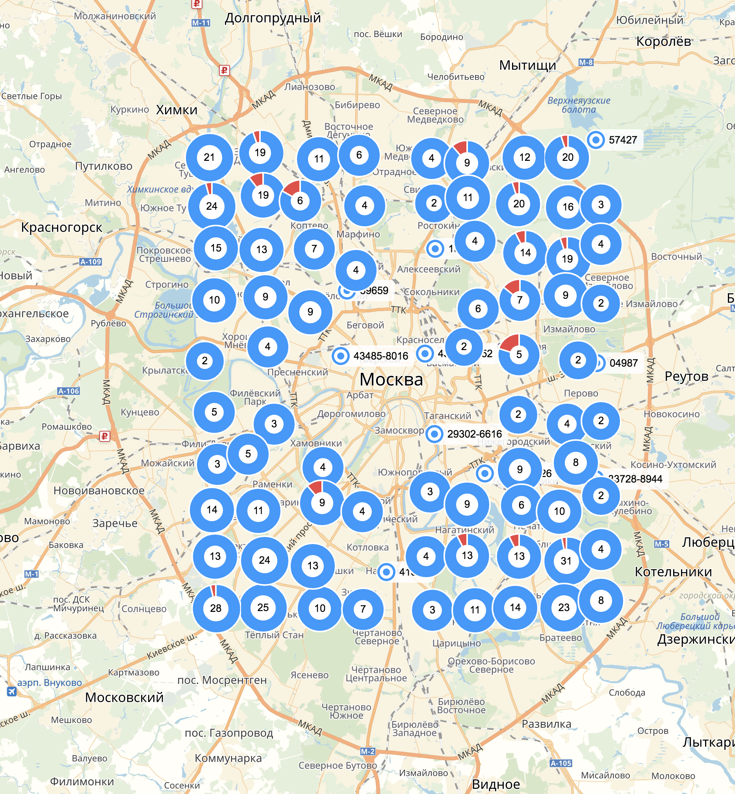
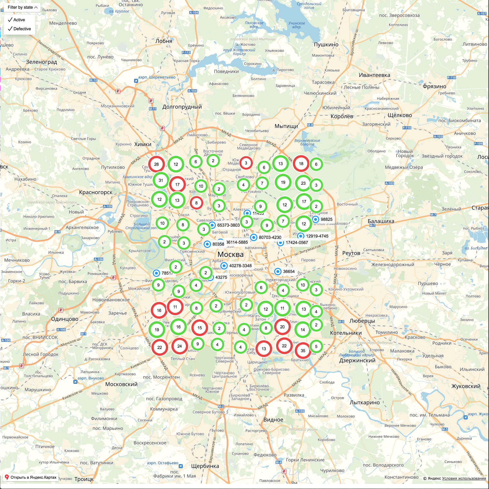
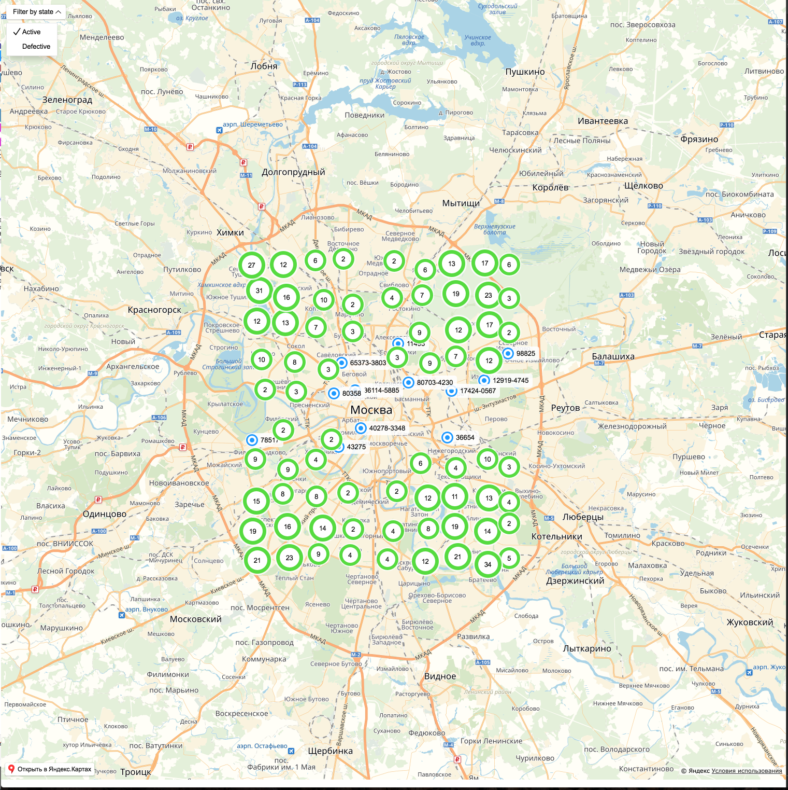

# Задание 1 — найди ошибки

В этом репозитории находятся материалы тестового задания "Найди ошибки" для [14-й Школы разработки интерфейсов](https://academy.yandex.ru/events/frontend/shri_msk-2018-2) (осень 2018, Москва, Санкт-Петербург, Симферополь).

Для работы тестового приложения нужен Node.JS v9. В проекте используются [Yandex Maps API](https://tech.yandex.ru/maps/doc/jsapi/2.1/quick-start/index-docpage/) и [ChartJS](http://www.chartjs.org).

## Задание

Код содержит ошибки разной степени критичности. Некоторые из них — стилистические, а другие — даже не позволят вам запустить приложение. Вам нужно найти все ошибки и исправить их.

Пункты для самопроверки:

1. Приложение должно успешно запускаться.
1. По адресу http://localhost:9000 должна открываться карта с метками.
1. Должна правильно работать вся функциональность, перечисленная в условиях задания.
1. Не должно быть лишнего кода.
1. Все должно быть в едином codestyle.

## Запуск

```
npm i
npm start
```

При каждом запуске тестовые данные генерируются заново случайным образом.


## Выполнение задания

### 1. Приложение должно успешно запускаться

#### Сообщение об ошибке

```
"export 'default' (imported as 'initMap') was not found in './map'
```

#### Описание решения

Исходя из описания ошибки понятно, что мы хотим импортировать из файла `src/map.js`, экспортируемое свойство "по умолчанию", которое не найдено. Делаем вывод, что скорее всего не правильно реализована работа с es6 модулями.

Решается 2-мя разными способами:

- Импорт с помощью деструктуризации в файле `src/index.js`:

```js
import { initMap } from "./map";
```
- Экспорт функции InitMap как экспорт по умолчанию в файле `src/map.js`:

```js
export default function initMap(ymaps, containerId) {
// code...
```
> [**commit**](https://github.com/MoonW1nd/solid-octo-funicular/commit/c51bef1577bf334e7236becaa0cd20270920c6d9) с исправлениями

### 2. По адресу http://localhost:9000 должна открываться карта с метками.

#### Описание решения
Далее видим белый экран, но без карты Москвы, в консоли ошибок нет. Заходим в `devtools` браузера, и видим, некорректные размеры элемента, высота равна `0`.

Задаем размеры элемента `#map` на всю страницу в index.css файле;
```css
 #map {
  width: 100%;
  height: 100%;
 }
```

> [**commit**](https://github.com/MoonW1nd/solid-octo-funicular/commit/c51bef1577bf334e7236becaa0cd20270920c6d9) с исправлениями

Но пока меток никаких нет. Читаем код в `src/map.js` и узнаем что для управления метками используется `objectManager`. Идем в [документацию к API](https://tech.yandex.ru/maps/doc/jsapi/2.1/ref/reference/ObjectManager-docpage/#method_detail__add) и ищем, как добавляются метки на карту. Находим метод `add` и вставляем его цепочку промисов, которая отвечает за загрузку данных;

```js
loadList().then(data => {
  objectManager.add(data);
}).then(() => {
  myMap.geoObjects.add(objectManager);
})
```

Но пока на карте Москвы ничего не отображается. Однако если уменьшить масштаб, мы найдем метки в другой точке мира. Делаем вывод, что неправильно обрабатываются получаемые координаты.
- Сначала смотрим откуда экспортируется функция `loadList`.
- Идем в файл `src/api.js`. Там видим что ответ от сервера разбирается функцией `mapServerData`, которая экспортируется из `mappers.js`.
- В `src/mappers.js` видим, что массив координат не правильно задается, перепутаны широта и долгота.
- Меняем их местами.

Теперь метки отображаются в нужном месте.

> [**commit**](https://github.com/MoonW1nd/solid-octo-funicular/commit/3d95f86a64d14dafedddefd7b82843c5e802f2f6) с исправлениями

### 3. Должна правильно работать вся функциональность, перечисленная в условиях задания.
Имеем список задач:<br/>
✔ Всю область экрана занимает интерактивная карта Москвы.<br/>
✔ На карте отображаются места размещения базовых станций.<br/>
✔ Если на небольшом пространстве много объектов, они объединяются в кластер.<br/>
✔ При клике на кластер карта масштабируется для просмотра объектов, входящих в него.<br/>
✔ Неисправные станции обозначаются на карте красным цветом, исправные — синим.<br/>
✔ Используя фильтр, можно отобразить на карте объекты с нужным состоянием — например, отобразить только неисправные.<br/>
✘ Если неисправный объект входит в кластер, то иконка кластера должна показывать, что в нем есть неисправная станция.<br/>
✘ При клике на метку базовой станции появляется попап с информацией о ней: серийный номер, состояние, количество активных дронов, график нагрузки.<br/>

Итак имеем две функциональности которые пока не работают, решил начать с последней.

#### При клике на метку базовой станции появляется попап с информацией о ней: серийный номер, координаты, состояние, количество активных дронов, график нагрузки.

При клике на базовую станцию получаем ошибку:

```
Uncaught TypeError: Cannot read property 'destroy' of null
```
- Исходя из нее мы делаем вывод, что в методе показа попапа, есть место где метод `destroy` был вызван на `null`.
- Ищем метод `destroy` в коде, и находим его в файле `details.js`, из которого экспортируется функция `getDetailsContentLayout`, которая отвечает за создание лэйаута внутри попапа(Bolloon).
- Видим что метод `destroy` используется, внутри функций переопределения стандартных методов `build` и `clear` `templateLayoutFactory` ([Doc](https://tech.yandex.ru/maps/doc/jsapi/2.1/ref/reference/layout.templateBased.Base-docpage/)).
- Однако эти функции переопределения используют стрелочные функции, стрелочные функции вообще не имеют контекста `this`, поиск `this` осуществляется так же, как и поиск обычной переменной, то есть, выше в замыкании, и соответственно `this` в этих функциях некорректен.
- Заменяем стрелочные функции на обычные.

Теперь при клике на маркер отображается попап с информацией и графиком, только график пуст.

- идем смотреть, как рисуется график в `src/chart.js`
- проверил что корректно передаются данные в функцию `createChart`
- читаем [API `chart.js`](http://www.chartjs.org/docs/latest/) и находим, что при формировании tiksOptions в `yAxis`, параметр max([api](http://www.chartjs.org/docs/latest/axes/cartesian/linear.html?h=max)) задан в 0, что и мешает корректной отрисовке графика.
- удаляем параметр `max` из tiksOptions в `yAxis`

> [**commit**](https://github.com/MoonW1nd/solid-octo-funicular/commit/6c74fb35624a35b97229ab747c1373d90437554a) с исправлениями


#### Если неисправный объект входит в кластер, то иконка кластера должна показывать, что в нем есть неисправная станция.

В данном задание мне показалось что есть 2 решения:

- **отображение с помощью pieChart:**
  - _все базовый станции_

  
  - _только активные базовые станции_

  
  - _только  не активные базовые станции_

  

- **отображение с помощью ClusterIcons:**
  - _все базовый станции_

  
  - _только активные базовые станции_

  
  - _только  не активные базовые станции_

  

_**Решение отображение с помощью pieChart**_

Удаляем из файла `src/map.js` строчку:

```js
  objectManager.clusters.options.set('preset', 'islands#greenClusterIcons');
```
Так как она перебивает ранее установленные стили для кластеров при инициализации(`clusterIconLayout: 'default#pieChart',`)

> [**commit**](https://github.com/MoonW1nd/solid-octo-funicular/commit/3e969fc937b32f04e48f9e3cc15bcb048e3fe725) с исправлениями

_**Решение отображение с помощью clusterIcon**_

Для того чтобы посмотреть данную реализацию нужно выполнить команду:

```
git checkout 08b1a2f
```

Реализация:

- удаляем из опций инициализации `clusterIconLayout: 'default#pieChart',`
- оставляем `objectManager.clusters.options.set('preset', 'islands#greenClusterIcons')`, либо можно прописать в настройках инициализации objectManager `preset: 'islands#greenClusterIcons',`
- добавляем обработчик события `add` на кластеры, который будет проверять есть ли в кластере неактивная станция, и если это так то цвет иконки меняется на красный.

```js
// установка стиля для кластеров содержащих неисправные станции
objectManager.clusters.events.add('add', () => {
  objectManager.clusters.each((cluster) => {
    if (cluster.features.some((feature) => feature.isActive === false)) {
      objectManager.clusters.setClusterOptions(cluster.id, { preset: 'islands#redClusterIcons' })
     }
   })
});
```

> [**commit**](https://github.com/MoonW1nd/solid-octo-funicular/commit/08b1a2fa37dba4460e035c5a30b0ac2ae076e281) с исправлениями

#### Итог

В итоге решил остановиться на первом варианте, так как показалось, что именно такое отображение было бы более логичным. И скорее всего такое решение и задумывалось, так как не предполагается, что в этом задании придется писать код.

### 4. Не должно быть лишнего кода.

- в файле `src/map.js` в инициализации objectManage не нужны свойства `clusterDisableClickZoom`([API](https://tech.yandex.ru/maps/doc/jsapi/2.1/ref/reference/ClusterPlacemark-docpage)) и `gridSize`([API](https://tech.yandex.ru/maps/doc/jsapi/2.1/ref/reference/Clusterer-docpage/)) так как они совпадают с значениями по умолчанию
- удалил `console.log` в файле `src/index.js`
- удалил файл `src/popup.js` так как он не нужен, потому что вид попапа определяется в файле `src/details.js` с помощью `templateLayoutFactory`.

> [**commit**](https://github.com/MoonW1nd/solid-octo-funicular/commit/34d9e506269238d80922bce367b31abb2f6d06a2) с исправлениями

### 5. Все должно быть в едином codestyle.

Так как не было никаких настроек в зависимостях `packaje.json`. То понял что по код стайлу нет никаких ограничений. Для обеспечения единого стиля кода прогнал все файлы через `Prettier`.

> [**commit**](https://github.com/MoonW1nd/solid-octo-funicular/commit/c836cc5cfa4865bd15d1bee2914827697e8b7c5e) с исправлениями


### Дополнительно

  - Добавил флаг `--host 0.0.0.0` для доступа к сайту с другой машины в той-же локальной сети